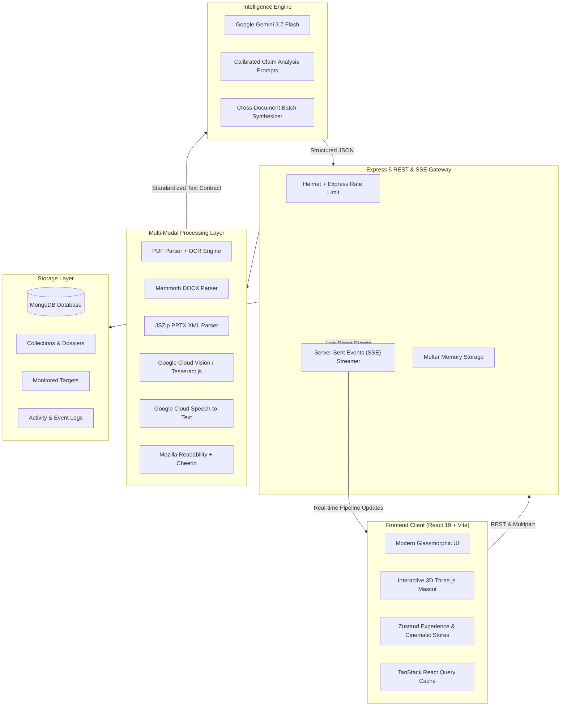

# Prism — AI-Powered Multi-Modal Misinformation & Credibility Intelligence Platform

<div align="center">

[](https://github.com/Manya22Kes/Prism---AI-Powered-Misinformation-Credibility-Analyzer)
[](https://deepmind.google/technologies/gemini/)
[](https://react.dev/)
[](https://threejs.org/)
[](https://tailwindcss.com/)
[](https://nodejs.org/)
[](https://www.mongodb.com/)
[](LICENSE)

*An enterprise-grade, multi-modal intelligence workstation designed to ingest, decompose, investigate, and score digital content across the full spectrum of modern misinformation.*

<br />

[](https://your-deployed-app-link.here)
[](https://your-deployed-backend-link.here)

**[👉 Click here to access the Live Application: https://your-deployed-app-link.here](https://your-deployed-app-link.here)**

</div>

---

## 🌐 Live Deployment

| Service | Environment | Status | Link |
| :--- | :--- | :--- | :--- |
| **Prism Web Console** | Production Client | Live | [https://your-deployed-app-link.here](https://your-deployed-app-link.here) |
| **Prism API Gateway** | Production REST & SSE | Live | [https://your-deployed-backend-link.here](https://your-deployed-backend-link.here) |

> 💡 *To update your deployment, replace `https://your-deployed-app-link.here` with your live frontend URL (e.g. Vercel, Netlify) and `https://your-deployed-backend-link.here` with your backend URL (e.g. Render, Railway, Google Cloud Run).*

---

## 🧭 Executive Overview

Digital misinformation no longer travels as isolated plain text. Today's narrative threats exploit visual memes, synthesized audio, distorted document screenshots, editorial manipulation, and coordinated multi-source spin.

**Prism** is an advanced credibility analysis platform that transforms raw, unstructured multi-modal media into rigorous, explainable intelligence dossiers. Powered by **Google Gemini 3.7 Flash**, hybrid OCR engines, and automated contradiction mapping, Prism decomposes complex assertions into atomic factual claims, extracts verifiable evidence, detects emotional and cognitive manipulation, and computes transparent credibility scores.

---

## ✨ Key Features & Capabilities

### 1. Multi-Modal Ingestion Pipeline
Prism normalizes and ingests seven distinct content streams through an agnostic extraction pipeline:
- **Raw Text & Dispatches**: Direct textual input with instant structure extraction.
- **Live URLs & News Articles**: Automated web scraping via Mozilla Readability and Cheerio with domain reputation lookups.
- **Documents (PDF, DOCX, PPTX)**: Hybrid text extraction combining native PDF stream parsing with automatic OCR fallback for scanned pages.
- **Images (PNG, JPG, WebP)**: Dual-layer OCR utilizing Google Cloud Vision API with offline Tesseract.js fallback.
- **Audio Transcriptions (MP3, WAV, M4A)**: Automatic speech-to-text processing via Google Cloud Speech-to-Text.
- **Multi-Document Batch Processing**: Simultaneous ingestion and cross-synthesis of up to 10 files, generating consensus matrixes and contradiction graphs.

### 2. Claim-Centric Intelligence Architecture
Rather than issuing opaque summary judgments, Prism breaks articles down into individual, falsifiable statements:
- **Atomic Claim Extraction**: Isolates key factual statements from rhetorical framing.
- **Evidence Verification**: Cross-references citations and evaluates supporting vs. debunking sources.
- **Fallacy & Framing Detection**: Surfaces emotional manipulation, selective quoting, false dilemmas, and loaded adjectives.
- **Transparent Credibility Gauge**: A calibrated 0–100 score driven by explainable metrics: *Factual Accuracy*, *Source Transparency*, *Logical Coherence*, and *Tone Neutrality*.

### 3. Cinematic 3D Interface & User Experience
- **Interactive 3D Prism Mascot**: An ambient Three.js / React Three Fiber crystalline companion that physically reacts to analysis states (*idle*, *processing*, *reading*, *vault*).
- **Dedicated Reading Mode**: An distraction-free editorial layout featuring adjustable typography, dark/light themes, and quick-access claim inspection.
- **Threat Watchlist**: Ongoing monitoring of critical URLs and domains with automated change-detection sweeps.
- **Investigative Collections**: Organize related reports and batches into custom dossiers with multi-item exports.
- **Mission Control & Diagnostics**: Real-time telemetry monitoring server health, active pipeline stages, and memory footprints.
- **Cross-Report Comparison**: Instant side-by-side comparative analysis accessible anywhere via `Cmd+K`.
- **Exportable PDF Intelligence Briefs**: One-click generation of branded, publication-ready intelligence reports.

---

## 🏛️ System Architecture



---

## 🚀 Quick Start

### 🐳 Option A: Docker Deployment (Recommended)

Run the entire Prism platform (React 19 Frontend, Express 5 Backend, and MongoDB) in a single command with zero local runtime setup:

```bash
# 1. Clone repository
git clone https://github.com/Manya22Kes/Prism---AI-Powered-Misinformation-Credibility-Analyzer.git
cd Prism---AI-Powered-Misinformation-Credibility-Analyzer

# 2. Copy environment template & provide your Gemini API key
cp .env.example .env
# Edit .env and set: GEMINI_API_KEY=your_actual_key

# 3. Launch all containers with Docker Compose
docker compose up --build -d
```

- **Frontend Console**: Available at `http://localhost` (Port 80)
- **Backend API Gateway**: Available at `http://localhost:5000/api/v1`
- **MongoDB**: Provisioned and persistent via `mongo_data` volume

To stop all services:
```bash
docker compose down
```

---

### 💻 Option B: Local Manual Setup

#### Prerequisites
- **Node.js**: v20.x or higher
- **MongoDB**: v6.x or higher (local instance or MongoDB Atlas cluster)
- **Google Gemini API Key**: Obtainable from [Google AI Studio](https://aistudio.google.com/)

#### 1. Repository Setup

```bash
git clone https://github.com/Manya22Kes/Prism---AI-Powered-Misinformation-Credibility-Analyzer.git
cd Prism---AI-Powered-Misinformation-Credibility-Analyzer
```

---

### 2. Backend Configuration & Launch

```bash
# Navigate to backend directory
cd backend

# Install dependencies
npm install

# Create environment file from template
cp .env.example .env
```

Open `backend/.env` and supply your credentials:

```env
PORT=5000
NODE_ENV=development
MONGO_URI=mongodb://127.0.0.1:27017/prism
GEMINI_API_KEY=your_gemini_api_key_here
GEMINI_MODEL=gemini-3.7-flash

# Optional: Google Cloud credentials for Cloud Vision / Cloud Speech
GOOGLE_APPLICATION_CREDENTIALS=./credentials/your_service_account_key.json
```

Start the backend daemon:

```bash
npm run dev
```
*Backend server will initialize on `http://localhost:5000`.*

---

### 3. Frontend Setup & Launch

Open a new terminal window:

```bash
# Navigate to frontend directory
cd frontend

# Install dependencies
npm install

# Create environment configuration
cp .env.example .env
```

Ensure `frontend/.env` points to the running backend:

```env
VITE_API_URL=http://localhost:5000/api/v1
```

Launch the frontend Vite development server:

```bash
npm run dev
```

*Navigate to `http://localhost:5173` in your browser.*

---

## 🛠️ Tech Stack & Dependencies

| Area | Technology | Purpose |
| :--- | :--- | :--- |
| **Frontend Framework** | React 19 + Vite 8 | Reactive, high-performance client environment |
| **3D Graphics** | Three.js + React Three Fiber + Drei | Real-time ambient 3D mascot and particle physics |
| **Styling & Design** | Tailwind CSS v4 | Futuristic, responsive glassmorphism system |
| **Motion** | Framer Motion | Smooth state transitions, dialogs, and overlays |
| **State Management** | Zustand + TanStack Query v5 | Reactive UI state, asynchronous cache synchronization |
| **Exporting** | jsPDF + html2canvas | High-fidelity intelligence dossier PDF exports |
| **Backend Framework** | Node.js + Express 5 | REST endpoints, SSE streaming, file ingest pipelines |
| **AI Modeling** | Google Gemini 3.7 Flash (`@google/genai`) | Analytical claim detection, bias scoring, and synthesis |
| **OCR & Vision** | Google Cloud Vision + Tesseract.js | Document and image optical character recognition |
| **Speech Processing** | Google Cloud Speech-to-Text | Multi-format audio transcription |
| **Database** | MongoDB + Mongoose 9 | Persistent reports, dossiers, watchlists, and activity feeds |

---

## 🧪 Verification & Benchmark Evaluation

Prism includes an automated evaluation suite to benchmark claim-detection accuracy, score calibration, and processing throughput against curated test datasets:

```bash
# From the backend directory:
npm run evaluate
```

To run the frontend production build and linter checks:

```bash
# From the frontend directory:
npm run lint
npm run build
```

---

## 🔒 Security & Privacy

- **Zero-Storage Secrets**: All API tokens, database URIs, and service account credentials are strictly decoupled via `.env` and `.gitignore`.
- **Sanitized Uploads**: In-memory streaming processors prevent unsanitized disk writes.
- **Client Sanitization**: DOMPurify safeguards all parsed content against XSS and injection vectors.

---

## 📄 License

This project is licensed under the **MIT License** — see the [LICENSE](LICENSE) file for details.

---

<div align="center">
Built with precision for information integrity.
</div>
